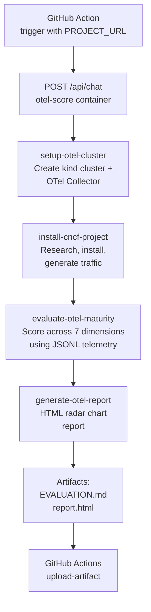

# otel-score

An AI-powered agent that automatically evaluates the OpenTelemetry instrumentation maturity of CNCF projects, designed to run as a GitHub Action.

## Overview

`otel-score` is a Spring Boot application backed by Claude (via Spring AI) that orchestrates a full end-to-end OpenTelemetry evaluation pipeline. Given the URL of a CNCF project's GitHub repository, it:

1. Spins up a local Kubernetes cluster with an OpenTelemetry Collector
2. Installs and exercises the target project
3. Collects and analyzes the emitted telemetry
4. Produces a structured maturity score across 7 dimensions with an HTML radar chart report

The goal is to make OTel maturity evaluation repeatable, automated, and consistent — enabling the CNCF ecosystem to track instrumentation quality over time.

## Goals

- **Automate** the labor-intensive process of evaluating a project's OpenTelemetry support
- **Standardize** evaluations using a well-defined 7-dimension maturity model
- **Scale** assessments across the entire CNCF project landscape via GitHub Actions
- **Produce** actionable, human-readable reports that project maintainers can act on
- **Track** maturity progression as projects evolve over time

## How It Works

The evaluation runs as a 4-phase pipeline, each phase driven by a Claude Code skill:



### Phase 1 — `setup-otel-cluster`

Creates a single-node [kind](https://kind.sigs.k8s.io/) Kubernetes cluster with an OpenTelemetry Collector deployed via Helm. The collector writes all received telemetry (traces, metrics, logs) to JSONL files at `/tmp/otel-eval-<project>/` on the host for programmatic inspection.

### Phase 2 — `install-cncf-project`

Researches the target project's official documentation and Helm charts, installs it into the evaluation cluster, and generates representative traffic to exercise its instrumentation. Saves research notes and install manifests to `.otel-eval/<project>/`.

### Phase 3 — `evaluate-otel-maturity`

Parses the collected JSONL telemetry files and evaluates the project against the [OpenTelemetry Support Maturity Model](#maturity-model). Produces a structured `EVALUATION.md` with per-dimension scores, evidence, and recommendations.

### Phase 4 — `generate-otel-report`

Renders a self-contained `report.html` with an interactive Chart.js radar chart, color-coded dimension summaries, and collapsible detail sections — ready to publish or attach to a GitHub issue.

## GitHub Actions Usage

> The container image is published to `ghcr.io/salaboy/otel-score` via the `publish.yml` workflow on every push to `main` and on version tags.

### Workflow inputs

| Input | Description |
|---|---|
| `project_url` | GitHub URL of the CNCF project to evaluate (e.g. `https://github.com/jaegertracing/jaeger`) |

### Required secrets

| Secret | Description |
|---|---|
| `ANTHROPIC_API_KEY` | Anthropic API key used by the otel-score agent |

### Example workflow

```yaml
name: Evaluate CNCF Project OTel Maturity

on:
  workflow_dispatch:
    inputs:
      project_url:
        description: 'CNCF project GitHub URL'
        required: true

jobs:
  evaluate:
    runs-on: ubuntu-latest
    steps:
      - name: Install cluster tools
        run: |
          # kind
          curl -Lo ./kind https://kind.sigs.k8s.io/dl/v0.24.0/kind-linux-amd64
          chmod +x ./kind && sudo mv ./kind /usr/local/bin/kind
          # helm
          curl https://raw.githubusercontent.com/helm/helm/main/scripts/get-helm-3 | bash

      - name: Start otel-score and trigger evaluation
        env:
          ANTHROPIC_API_KEY: ${{ secrets.ANTHROPIC_API_KEY }}
        run: |
          docker run -d --name otel-score \
            -e ANTHROPIC_API_KEY=$ANTHROPIC_API_KEY \
            -p 8080:8080 \
            ghcr.io/salaboy/otel-score:latest

          # Wait for the service to be ready
          until curl -sf http://localhost:8080/actuator/health; do sleep 2; done

          # Trigger evaluation
          curl -X POST http://localhost:8080/api/chat \
            -H "Content-Type: application/json" \
            -H "Accept: text/event-stream" \
            -d "{\"conversationId\": \"eval-1\", \"message\": \"Evaluate ${{ github.event.inputs.project_url }}\"}"

      - name: Upload evaluation artifacts
        uses: actions/upload-artifact@v4
        with:
          name: otel-evaluation
          path: |
            .otel-eval/*/EVALUATION.md
            .otel-eval/*/report.html
```

### Runner requirements

The GitHub Actions runner must have the following tools available before starting the evaluation:

- `docker` (pre-installed on `ubuntu-latest`)
- `kind` v0.24+
- `kubectl` (pre-installed on `ubuntu-latest`)
- `helm` v3+

## Local Development

### Prerequisites

- Java 21+
- Maven (or use the included `./mvnw` wrapper)
- `kind`, `kubectl`, `helm`, `docker` (running)

### Environment variables

| Variable | Required | Description |
|---|---|---|
| `ANTHROPIC_API_KEY` | Yes | Anthropic API key — passed to Spring AI (`spring.ai.anthropic.api-key`) |
| `OTEL_EXPORTER_OTLP_ENDPOINT` | No | OTLP base URL for exporting the application's own traces, metrics, and logs (e.g. `https://ingress.us1.dash0.com`) |
| `OTEL_EXPORTER_OTLP_HEADERS_API_KEY` | No | Bearer token added to the `Authorization` header on every OTLP export request |
| `DASH0_DATASET` | No | Value sent as the `Dash0-Dataset` header on every OTLP export request |

The application always exports its own telemetry to the endpoints above (all three signals — traces, metrics, logs). If the OTLP variables are not set, Spring Boot will log errors on startup but the evaluation API will still work.

Other notable defaults set in `application.yml`:

| Property | Default | Notes |
|---|---|---|
| `spring.ai.anthropic.chat.options.model` | `claude-sonnet-4-6` | Model used for evaluations |
| `spring.ai.anthropic.chat.options.max-tokens` | `4096` | Maximum tokens per response |
| `spring.ai.anthropic.chat.options.temperature` | `0.7` | Sampling temperature |
| `management.tracing.sampling.probability` | `1.0` | 100 % trace sampling for the app itself |
| `server.port` | `8080` | HTTP port |

### Set up the evaluation cluster

Before starting the application, create the kind cluster with the OTel Collector and test backend:

```bash
bash scripts/setup-otel-cluster.sh <project-name>
# e.g.
bash scripts/setup-otel-cluster.sh jaeger
```

### Run

```bash
export ANTHROPIC_API_KEY=your-key-here

# Optional — export the app's own telemetry to an OTLP backend
export OTEL_EXPORTER_OTLP_ENDPOINT=https://ingress.us1.dash0.com
export OTEL_EXPORTER_OTLP_HEADERS_API_KEY=your-dash0-token
export DASH0_DATASET=otel-score

./mvnw spring-boot:run
```

The API is available at `http://localhost:8080`.

### Trigger an evaluation

```bash
curl -X POST http://localhost:8080/api/chat \
  -H "Content-Type: application/json" \
  -H "Accept: text/event-stream" \
  -d '{"conversationId": "eval-jaeger", "clusterName": "otel-eval-jaeger", "message": "Install https://github.com/jaegertracing/jaeger, evaluate its OTel maturity, and generate the report."}' \
  --max-time 7200
```

### Run tests

```bash
./mvnw test
```

## Maturity Model

Each project is evaluated across **7 dimensions** on a **0–3 scale**:

| Level | Name | Description |
|---|---|---|
| 0 | Instrumented | Telemetry exists but uses proprietary formats or non-OTel SDKs |
| 1 | OTel-Aligned | Uses OTel SDK but with custom conventions or partial coverage |
| 2 | OTel-Native | Full OTel SDK adoption with semantic conventions |
| 3 | OTel-Optimized | Exemplary OTel usage; documented contracts, multi-signal correlation |

### Dimensions

1. **Integration Surface** — how telemetry is exposed (tool-coupled vs. standard OTel integration)
2. **Semantic Conventions** — whether OTel semantic conventions are followed or proprietary schemas are used
3. **Resource Attributes & Configuration** — identity attributes and support for `OTEL_*` environment variables
4. **Trace Modeling & Context Propagation** — span structure, parent-child relationships, distributed context
5. **Multi-Signal Observability** — correlation across traces, metrics, and logs
6. **Audience & Signal Quality** — whether signals are useful to end users vs. only project developers
7. **Stability & Change Management** — documented instrumentation contracts and versioning

See `.claude/skills/maturity-model-spec.md` for the full specification.

## Evaluation Results

The `/results` folder contains the evaluation results for different projects.

## Contributing

1. Fork the repository
2. Create a feature branch
3. Open a pull request describing the change

Issues and feature requests: open a GitHub issue.

## License

Apache License 2.0 — see [LICENSE](LICENSE).
